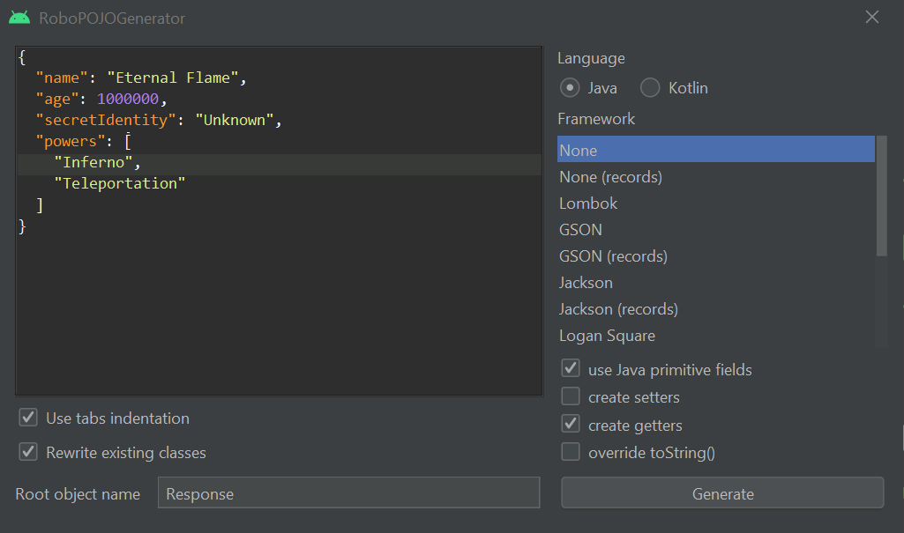

# Плагины для Android Studio
Сегодня я покажу топ плагинов, которые я использую сам.
## 1. Robo Pojo Generation
[Robo Pojo Generation](https://plugins.jetbrains.com/plugin/8634-robopojogenerator) — превращает json объект в java/kotlin класс. 

Чтобы сгенерировать класс, нажимаем ПКМ по директории и выбираем пункт "Generate POJO from JSON", как на ниже скрине:


В поле "Language" выбирается язык, на основе которого будет создан класс. В списке Framework выбираете нужный вам Framework (к примеру GSON, пример кода будет дальше). "Logan Square" отвечает за добавление getter'ов, setter'ов, типы полей, и переопределние метода toString().


Настройки выставленные на скриншоте генерируют следующий код:

```Java
import java.util.List;

public class Response{
	private String secretIdentity;
	private String name;
	private List<String> powers;
	private int age;

	public String getSecretIdentity(){
		return secretIdentity;
	}

	public String getName(){
		return name;
	}

	public List<String> getPowers(){
		return powers;
	}

	public int getAge(){
		return age;
	}
}
```
Пример. Если в списке Framework выбрать GSON:

```Java
import java.util.List;
import com.google.gson.annotations.SerializedName;

public class Response{

	@SerializedName("secretIdentity")
	private String secretIdentity;

	@SerializedName("name")
	private String name;

	@SerializedName("powers")
	private List<String> powers;

	@SerializedName("age")
	private int age;

	public String getSecretIdentity(){
		return secretIdentity;
	}

	public String getName(){
		return name;
	}

	public List<String> getPowers(){
		return powers;
	}

	public int getAge(){
		return age;
	}
}
```
Внимание! Возможна ошибка, если вы не подключили следующую зависимость в gradle:

`implementation 'com.google.code.gson:gson:2.6.2'`


## 2. String Manipulation
[String Manipulation](https://plugins.jetbrains.com/plugin/2162-string-manipulation) — меняет слова переменных местами, выравнивает json, сортирует строки.


## 3. Dummy Text Generation
[Dummy Text Generation](https://plugins.jetbrains.com/plugin/7216-dummy-text-generator) — генерация рандомного текста.

## 4. Randomness
[Randomness](https://plugins.jetbrains.com/plugin/9836-randomness) — тоже генерация рандомного текста, но с более гибкими настройками.

## 5. Kotlin Fill Class
[Kotlin Fill Class](https://plugins.jetbrains.com/plugin/10942-kotlin-fill-class) — выводит все аргументы функции для заполнения их значений.

## 6. ADB Idea
[ADB Idea](https://plugins.jetbrains.com/plugin/7380-adb-idea) — работа с ADB (очистка памяти, кэша, удаление приложения и т.д)
